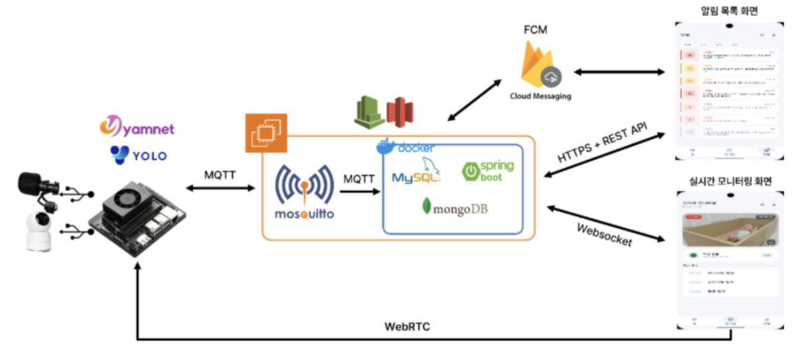
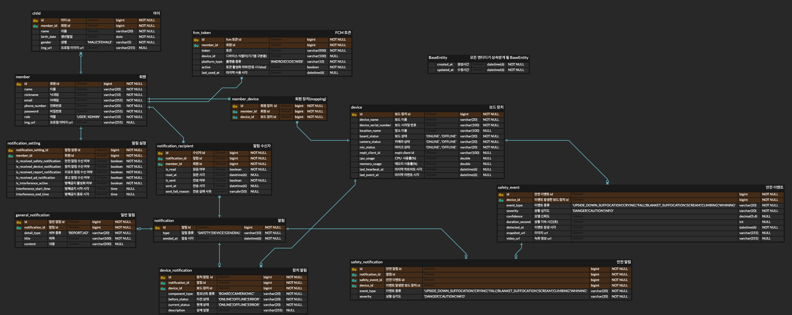

# 👶 아이봄 Backend

> AIoT 기반 영유아 안전 모니터링 서비스

---

## 📌 프로젝트 소개

**아이봄**은 카메라와 마이크를 통해 영유아의 상태를 실시간으로 모니터링하고, AI가 위험 상황과 울음을 감지하여 보호자에게 알리는 스마트 돌봄 서비스입니다.

Jetson Orin Nano에서 감지한 위험 이벤트와 기기 상태를 MQTT로 전송하면, 백엔드는 데이터를 처리·저장하고 FCM을 통해 Android 앱에 실시간 알림을 전달합니다.

보호자는 앱에서 다음 정보를 확인할 수 있습니다.

* 위험 상황 푸시 알림
* 위험 이벤트 상세 기록
* 기기 및 구성요소 상태
* 실시간 영상 스트리밍

### 🚨 주요 감지 이벤트

* 낙상
* 난간 오름
* 뒤집힘
* 얼굴 덮임
* 안전 영역 이탈
* 울음

---

## 🛠️ 기술 스택

### Backend

<p>
  
  
  
  
</p>

### Database

<p>
  
  
  
</p>

### Messaging & Notification

<p>
  
  
  
  
</p>

### Infrastructure

<p>
  
  
  
  
</p>

---

## 🏗️ 시스템 아키텍처



### 구성 요소

* **Jetson Orin Nano**

    * 영상·음성 AI 추론
    * 위험 이벤트 감지
    * 기기 상태 및 Heartbeat 발행

* **Mosquitto Broker**

    * Jetson과 백엔드 사이의 MQTT 메시지 중계
    * 위험 이벤트, 기기 상태, Heartbeat, WebRTC Signaling 전달

* **Spring Boot Backend**

    * MQTT 메시지 구독 및 처리
    * REST API 제공
    * 이벤트·기기 상태 저장
    * FCM 푸시 알림 전송

* **Android App**

    * 위험 알림 및 이벤트 기록 조회
    * 기기 상태 확인
    * 실시간 영상 스트리밍

> 실시간 영상은 Jetson Orin Nano와 Android 앱 사이의 **WebRTC P2P 방식**으로 전송됩니다.

---

## 🗄️ 데이터베이스 설계

데이터의 관계, 발생 빈도와 조회 목적에 따라 **MySQL, MongoDB, Redis**의 역할을 분리했습니다.

---

### 🐬 MySQL

회원, 기기, 알림 등 관계와 정합성이 중요한 핵심 도메인 데이터를 영구 저장합니다.



#### 저장 데이터

* 회원 계정
* 영유아 정보
* 기기 정보
* 알림 공통 정보
* 알림 수신자
* 안전 이벤트

#### 선택 이유

* 트랜잭션 지원
* 관계 무결성 보장
* 핵심 서비스 데이터의 안정적인 영구 저장

---

### 🍃 MongoDB

지속적으로 누적되는 위험 이벤트와 기기 상태 로그를 저장합니다.

#### 주요 컬렉션

```text
danger_event_log
device_status_log
```

* `danger_event_log`

    * AI 위험 이벤트 원본
    * 감지 결과 및 처리 로그

* `device_status_log`

    * 기기 상태 변경 이력
    * 카메라·마이크·보드 상태
    * 시스템 자원 정보

#### 선택 이유

* 이벤트마다 달라질 수 있는 데이터 구조에 유연하게 대응
* 지속적으로 누적되는 로그 데이터 저장에 적합
* 비동기 로그 저장과 이력 조회에 활용

---

### ⚡ Redis

빠른 조회와 자동 만료가 필요한 실시간 상태 및 세션 데이터를 저장합니다.

| Key 패턴                    | 저장 데이터               |               TTL | 용도               |
|---------------------------|----------------------|------------------:|------------------|
| `device:pending:{serial}` | 등록 전 기기 Heartbeat 정보 |               10분 | 기기 등록 전 임시 상태 보관 |
| `device:danger:{serial}`  | 현재 위험 상태             | 24시간 또는 이벤트 지속 시간 | 실시간 위험 상태 추적     |
| Spring Session Key        | 사용자 로그인 세션           |                7일 | 세션 기반 사용자 인증     |

#### 선택 이유

* 메모리 기반의 빠른 읽기·쓰기
* TTL을 활용한 임시 데이터 자동 삭제
* 실시간 상태와 로그인 세션의 빠른 조회